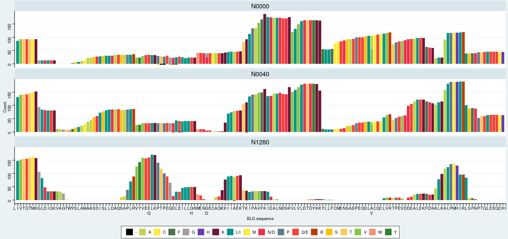
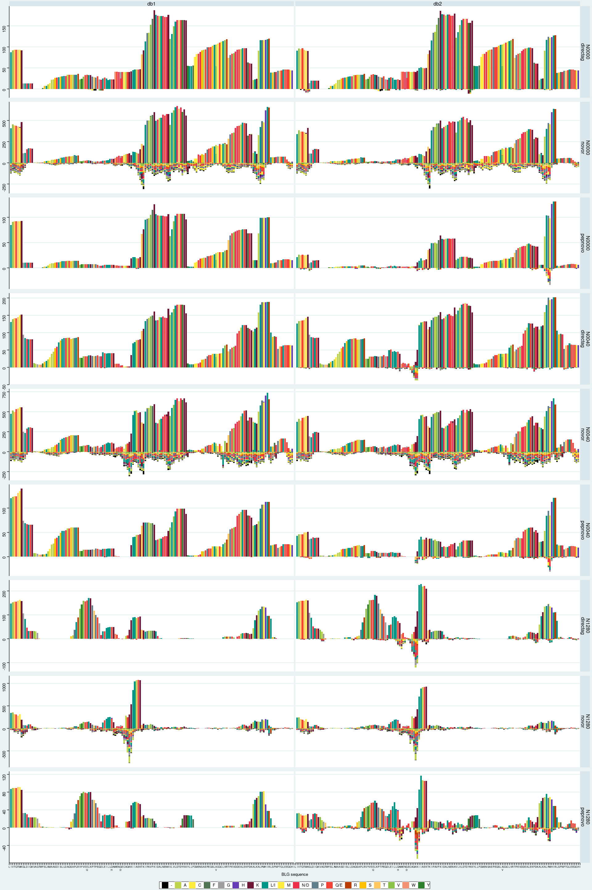
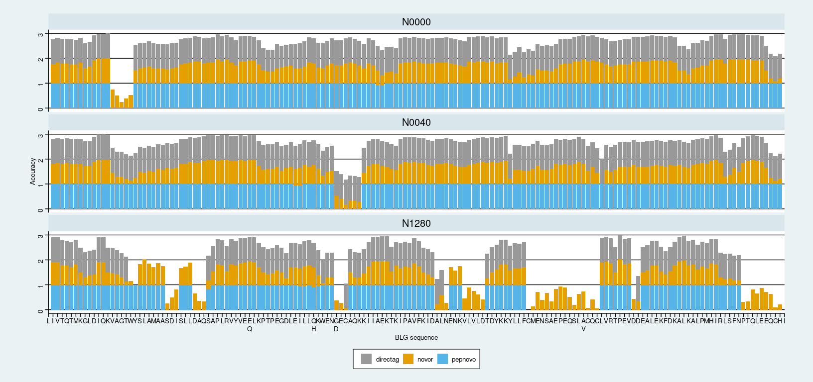
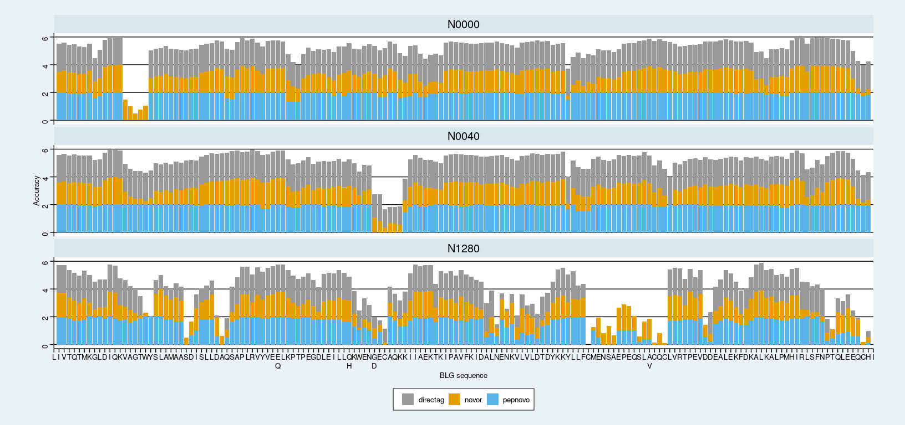
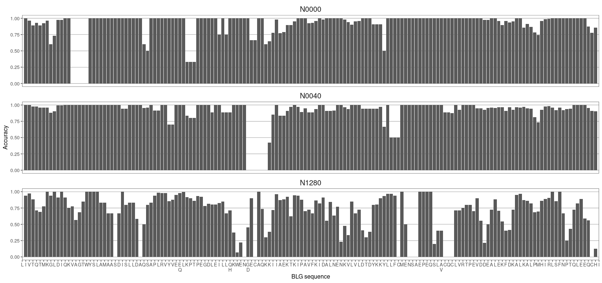
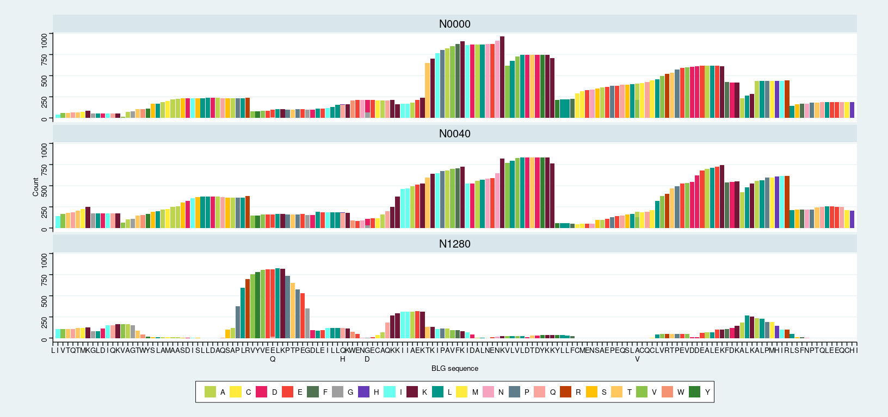
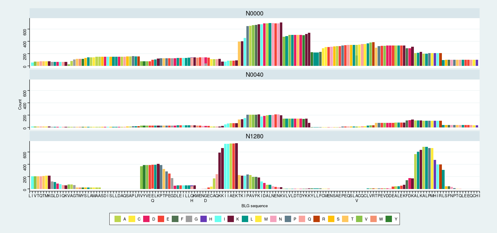
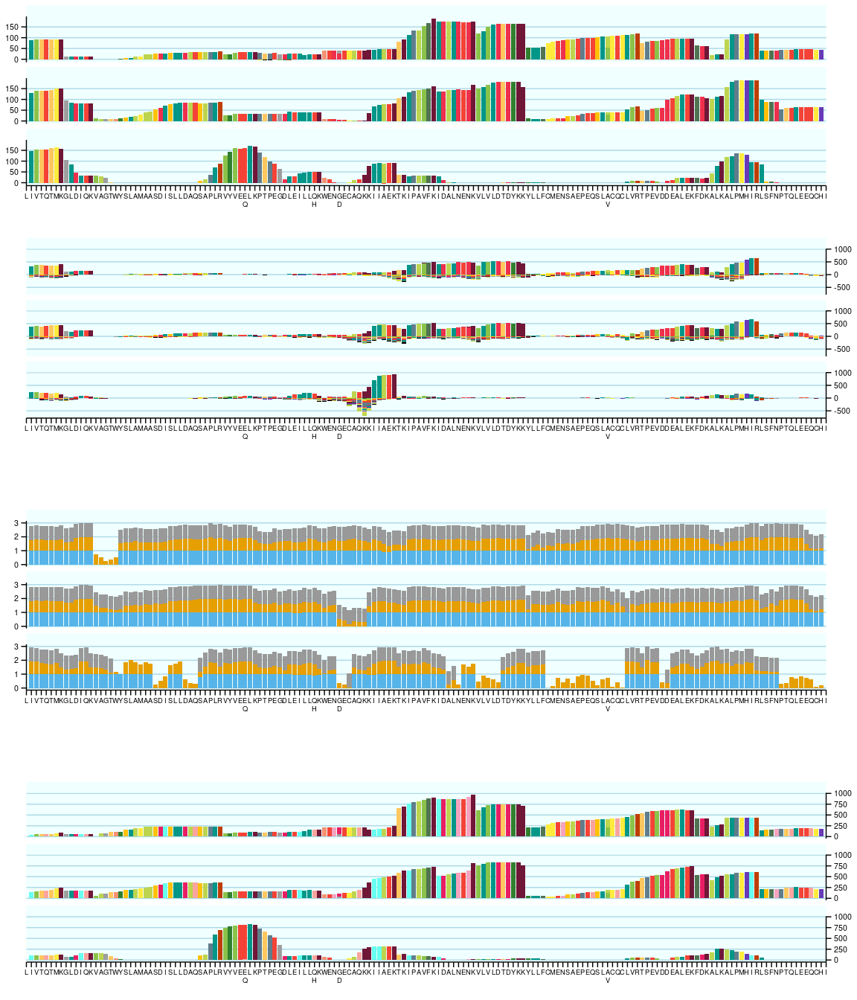

<!-- # --- -->

title: “Plot positions” author: Ismael Rodriguez output:
github_document: html_preview: false

------------------------------------------------------------------------

``` r
library(ggplot2)
library(tidyverse)
```

    ## ── Attaching core tidyverse packages ─────────────────────────────────────────────────── tidyverse 2.0.0 ──
    ## ✔ dplyr     1.1.3     ✔ readr     2.1.4
    ## ✔ forcats   1.0.0     ✔ stringr   1.5.0
    ## ✔ lubridate 1.9.3     ✔ tibble    3.2.1
    ## ✔ purrr     1.0.2     ✔ tidyr     1.3.0
    ## ── Conflicts ───────────────────────────────────────────────────────────────────── tidyverse_conflicts() ──
    ## ✖ dplyr::filter() masks stats::filter()
    ## ✖ dplyr::lag()    masks stats::lag()
    ## ℹ Use the conflicted package (<http://conflicted.r-lib.org/>) to force all conflicts to become errors

``` r
library(ggpubr)
library(ggthemes)
library(patchwork)
```

``` r
project = '~/palaeoproteomics/BLG/analysis_results/'
```

# Define colors and BLG sequence

``` r
aacols = c(
    "V" = "#8bc34a",
    #
    "I" = "#66fff0",
    "L" = "#009688",
    "L/I" = "#009688",# Average of Ile and Leu
    #
    "F" = "#507351", #9c27b0
    "C" = "#ffeb3b",
    "M" = "#ffeb3b",
    "A" = "#bdd54e",
    "G" = "#9e9e9e",
    "T" = "#ffc75e",
    "W" = "#f49272", #673ab7
    "S" = "#ffc107",
    "Y" = "#30802f",
    "P" = "#607d8b",
    "H" = "#673ab7",
    #
    "Q" = "#faa49e",
    "E" = "#f44336",
    "Q/E" = "#f44336", # Average of Glu and Gln
    #
    "N" = "#f5a3be",
    "D" = "#e81e63",
    "N/D" = "#ee304c", # Average of Asp and Asn
    #
    "K" = "#701637",
    "R" = "#bd3e04",  # 795548  ff5722   c28897
    '-' = 'black'
)
```

``` r
blg_seq = 'M,K,C,L,L,L,A,L,A,L,T,C,G,A,Q,A,L,I,V,T,Q,T,M,K,G,L,D,I,Q,K,V,A,G,T,W,Y,S,L,A,M,A,A,S,D,I,S,L,L,D,A,Q,S,A,P,L,R,V,Y,V,E,E\nQ,L,K,P,T,P,E,G,D,L,E,I,L,L,Q\nH,K,W,E,N,G\nD,E,C,A,Q,K,K,I,I,A,E,K,T,K,I,P,A,V,F,K,I,D,A,L,N,E,N,K,V,L,V,L,D,T,D,Y,K,K,Y,L,L,F,C,M,E,N,S,A,E,P,E,Q,S,L,A\nV,C,Q,C,L,V,R,T,P,E,V,D,D,E,A,L,E,K,F,D,K,A,L,K,A,L,P,M,H,I,R,L,S,F,N,P,T,Q,L,E,E,Q,C,H,I'

blg_seq = strsplit(blg_seq, ',')[[1]]

chain_start = 17
chain_end = 178

blg_seq = blg_seq[chain_start:length(blg_seq)]

# names(blg_seq) = as.character(seq(1,178))
# blg_seq
```

# *De novo*

## Plot *de novo* coverage

Change B for L/I X for N/D Z for Q/E

``` r
denovo_position_letters = read_csv(file.path(project, 'denovo_position_letters.csv'))
```

    ## Rows: 16063 Columns: 10
    ## ── Column specification ───────────────────────────────────────────────────────────────────────────────────
    ## Delimiter: ","
    ## chr (3): Run_id, Sample, pep_letters
    ## dbl (7): pep_positions, count, pep_identity, total_counts, rel_count, count_mirror, rel_count_mirror
    ## 
    ## ℹ Use `spec()` to retrieve the full column specification for this data.
    ## ℹ Specify the column types or set `show_col_types = FALSE` to quiet this message.

``` r
denovo_position_letters$pep_positions = as.integer(denovo_position_letters$pep_positions)

denovo_position_letters = denovo_position_letters %>%
  mutate(pep_letters = replace(pep_letters, pep_letters == 'B', 'L/I')) %>%
  mutate(pep_letters = replace(pep_letters, pep_letters == 'X', 'N/D')) %>%
  mutate(pep_letters = replace(pep_letters, pep_letters == 'Z', 'Q/E')) %>%
  mutate(pep_positions = as.integer(pep_positions)) %>%
  filter(pep_positions<=chain_end, pep_positions>=chain_start) %>%
  separate('Run_id', into=c('Software', 'DB'), sep='_', remove = FALSE)

denovo_position_letters
```

    ## # A tibble: 15,402 × 12
    ##    Run_id       Software DB    Sample pep_positions pep_letters count pep_identity total_counts rel_count
    ##    <chr>        <chr>    <chr> <chr>          <int> <chr>       <dbl>        <dbl>        <dbl>     <dbl>
    ##  1 directag_db1 directag db1   N0000             17 L/I            81            1           81         1
    ##  2 directag_db1 directag db1   N0000             18 L/I            87            1           87         1
    ##  3 directag_db1 directag db1   N0000             19 V              92            1           92         1
    ##  4 directag_db1 directag db1   N0000             20 T              93            1           93         1
    ##  5 directag_db1 directag db1   N0000             21 Q/E            93            1           93         1
    ##  6 directag_db1 directag db1   N0000             22 T              93            1           93         1
    ##  7 directag_db1 directag db1   N0000             23 M              93            1           93         1
    ##  8 directag_db1 directag db1   N0000             24 K              92            1           92         1
    ##  9 directag_db1 directag db1   N0000             25 G              13            1           13         1
    ## 10 directag_db1 directag db1   N0000             26 L/I            13            1           13         1
    ## # ℹ 15,392 more rows
    ## # ℹ 2 more variables: count_mirror <dbl>, rel_count_mirror <dbl>

``` r
denovo_runs = unique(denovo_position_letters$Run_id)
```

``` r
denovo_count_plots = list()

for (run_id in denovo_runs) {
  p1 = denovo_position_letters %>% dplyr::filter(Run_id == run_id) %>%
    ggplot() +
      geom_bar(mapping = aes(x=pep_positions, y=count_mirror, fill=pep_letters), position='stack', 
               stat='identity') +
      facet_wrap(~Sample, nrow=3, scales = 'fixed') +
      scale_fill_manual(values=aacols) +
      scale_x_continuous(breaks = seq(chain_start, chain_end), labels = blg_seq,
                         limits = c(chain_start, chain_end), expand = c(0, 0)) +
      xlab('BLG sequence') + ylab('Count') +
      guides(fill=guide_legend(nrow=1,byrow=TRUE)) +
      theme_stata() +
      theme(panel.grid.major.y = element_line(size=0.5),
            legend.title = element_blank(), strip.text.x = element_text(size = 15),
            plot.margin = margin(2, 5, 2, 5))
    denovo_count_plots[[run_id]] = p1
}
```

    ## Warning: The `size` argument of `element_line()` is deprecated as of ggplot2 3.4.0.
    ## ℹ Please use the `linewidth` argument instead.
    ## This warning is displayed once every 8 hours.
    ## Call `lifecycle::last_lifecycle_warnings()` to see where this warning was generated.

``` r
denovo_count_plots$directag_db1
```

    ## Warning: Removed 5 rows containing missing values (`geom_bar()`).

<!-- -->

``` r
denovo_legend = as_ggplot(
  get_legend(denovo_count_plots$novor_db1))
```

    ## Warning: Removed 83 rows containing missing values (`geom_bar()`).

``` r
ggsave('denovo_legend.png', denovo_legend, 'png', project,
       width=10, height=1, dpi=400)
ggsave('denovo_legend.svg', denovo_legend, 'svg', project,
       width=10, height=1, dpi=400)


ggsave('novor_db1_cov.png', denovo_count_plots$novor_db1, 'png', project,
       width=17, height=8, dpi=400)
```

    ## Warning: Removed 83 rows containing missing values (`geom_bar()`).

``` r
ggsave('novor_db1_cov.svg', denovo_count_plots$novor_db1, 'svg', project,
       width=17, height=8, dpi=400)
```

    ## Warning: Removed 83 rows containing missing values (`geom_bar()`).

``` r
ggsave('directag_db1_cov.png', denovo_count_plots$directag_db1, 'png', project,
       width=17, height=8, dpi=400)
```

    ## Warning: Removed 5 rows containing missing values (`geom_bar()`).

``` r
ggsave('directag_db1_cov.svg', denovo_count_plots$directag_db1, 'svg', project,
       width=17, height=8, dpi=400)
```

    ## Warning: Removed 5 rows containing missing values (`geom_bar()`).

``` r
denovo_position_letters = denovo_position_letters %>% group_by(Software, Sample) %>%
  mutate(MAX = max(count_mirror), MIN = min(count_mirror))
```

``` r
ggplot(denovo_position_letters, aes(x=pep_positions, y=count_mirror, fill=pep_letters)) +
  geom_bar(position='stack', stat='identity') +
  geom_blank(aes(y=MAX)) + geom_blank(aes(y=MIN)) +
  facet_grid(Sample + Software ~ DB, scales='free') +
  scale_fill_manual(values=aacols) +
  scale_x_continuous(breaks = seq(chain_start, chain_end), labels = blg_seq,
                     limits = c(chain_start, chain_end), expand = c(0, 0)) +
  xlab('BLG sequence') + ylab('Count') +
  guides(fill=guide_legend(nrow=1,byrow=TRUE)) +
  theme_stata() +
  theme(panel.grid.major.y = element_line(size=1),
        legend.title = element_blank(),
        strip.text = element_text(size = 12, margin = margin(0,0,0,0)),
        axis.title.y = element_blank(),
        axis.text.x = element_text(size=6),
        plot.margin = margin(3,5,3,5),
        legend.margin = margin(0,0,0,0),
        strip.switch.pad.grid = unit(0, 'cm'),
        strip.switch.pad.wrap = unit(0, 'cm'),
        strip.placement = 'inside',
        panel.spacing.y = unit(10, 'pt'))
```

    ## Warning: Removed 193 rows containing missing values (`geom_bar()`).

<!-- -->

## Plot accuracy per position

``` r
denovo_position_acc = read_csv(file.path(project, 'denovo_position_accuracy.csv'))
```

    ## Rows: 2898 Columns: 4
    ## ── Column specification ───────────────────────────────────────────────────────────────────────────────────
    ## Delimiter: ","
    ## chr (2): Run_id, Sample
    ## dbl (2): pep_positions, pos_accuracy
    ## 
    ## ℹ Use `spec()` to retrieve the full column specification for this data.
    ## ℹ Specify the column types or set `show_col_types = FALSE` to quiet this message.

``` r
denovo_position_acc = denovo_position_acc %>%
  mutate(pep_positions = as.integer(pep_positions)) %>%
  filter(pep_positions<=chain_end, pep_positions>=chain_start) %>%
  separate('Run_id', into=c('Software', 'DB'), sep='_', remove = FALSE)
denovo_position_acc
```

    ## # A tibble: 2,772 × 6
    ##    Run_id       Software DB    Sample pep_positions pos_accuracy
    ##    <chr>        <chr>    <chr> <chr>          <int>        <dbl>
    ##  1 directag_db1 directag db1   N0000             17            1
    ##  2 directag_db1 directag db1   N0000             18            1
    ##  3 directag_db1 directag db1   N0000             19            1
    ##  4 directag_db1 directag db1   N0000             20            1
    ##  5 directag_db1 directag db1   N0000             21            1
    ##  6 directag_db1 directag db1   N0000             22            1
    ##  7 directag_db1 directag db1   N0000             23            1
    ##  8 directag_db1 directag db1   N0000             24            1
    ##  9 directag_db1 directag db1   N0000             25            1
    ## 10 directag_db1 directag db1   N0000             26            1
    ## # ℹ 2,762 more rows

``` r
colorBlindGrey8   <- c("#999999", "#E69F00", "#56B4E9", "#009E73", 
                       "#F0E442", "#0072B2", "#D55E00", "#CC79A7")


db1_acc = denovo_position_acc %>%
  filter(DB == 'db1') %>%
    ggplot() +
      geom_bar(mapping = aes(x=pep_positions, y=pos_accuracy, fill=Software),
               stat='identity', position='stack') +
      facet_wrap(~Sample, nrow=3, scales='fixed') +
      scale_x_continuous(breaks = seq(chain_start, chain_end), labels = blg_seq,
                         limits = c(chain_start, chain_end), expand=c(0,0)) +
      xlab('BLG sequence') + ylab('Accuracy') +
      scale_fill_manual(values=colorBlindGrey8) +
      guides(fill=guide_legend(nrow=1,byrow=TRUE)) +
      theme_stata() +
      theme(panel.grid.major.y = element_line(size=0.5, color='black'),
            legend.title = element_blank(), strip.text.x = element_text(size = 15))

ggsave('db1_acc.png', db1_acc, 'png', project,
       width=17, height=8, dpi=400)
```

    ## Warning: Removed 16 rows containing missing values (`geom_bar()`).

``` r
ggsave('db1_acc.svg', db1_acc, 'svg', project,
       width=17, height=8, dpi=400)
```

    ## Warning: Removed 16 rows containing missing values (`geom_bar()`).

``` r
db1_acc
```

    ## Warning: Removed 16 rows containing missing values (`geom_bar()`).

<!-- -->

``` r
acc_legend = as_ggplot(
  get_legend(db1_acc))
```

    ## Warning: Removed 16 rows containing missing values (`geom_bar()`).

``` r
acc_legend
```

<!-- -->

``` r
ggsave('acc_legend.png', acc_legend, 'png', project,
       width=3, height=1, dpi=400)
ggsave('acc_legend.svg', acc_legend, 'svg', project,
       width=3, height=1, dpi=400)

db2_acc = denovo_position_acc %>%
  ggplot() +
      geom_bar(mapping = aes(x=pep_positions, y=pos_accuracy, fill=Software),
               stat='identity', position='stack') +
      facet_wrap(~Sample, nrow=3, scales='fixed') +
      scale_x_continuous(breaks = seq(chain_start, chain_end), labels = blg_seq,
                         limits = c(chain_start, chain_end), expand=c(0,0)) +
      xlab('BLG sequence') + ylab('Accuracy') +
      scale_fill_manual(values=colorBlindGrey8) +
      guides(fill=guide_legend(nrow=1,byrow=TRUE)) +
      theme_stata() +
      theme(panel.grid.major.y = element_line(size=0.5, color='black'),
            legend.title = element_blank(), strip.text.x = element_text(size = 15))
db2_acc
```

    ## Warning: Removed 34 rows containing missing values (`geom_bar()`).

<!-- -->

``` r
all_acc = ggplot(denovo_position_acc) +
    geom_bar(mapping = aes(x=pep_positions, y=pos_accuracy, fill=Run_id),
             stat='identity', position='stack') +
    facet_wrap(~Sample, nrow=3, scales='fixed') +
    scale_x_continuous(breaks = seq(chain_start, chain_end), labels = blg_seq,
                       limits = c(chain_start, chain_end), expand=c(0,0)) +
    xlab('BLG sequence') + ylab('Accuracy') +
    guides(fill=guide_legend(nrow=1,byrow=TRUE)) +
      theme_stata() +
    theme(panel.grid.major.y = element_line(size=0.2),
          legend.title = element_blank(), strip.text.x = element_text(size = 15))
```

``` r
denovo_acc_plots = list()

for (run_id in denovo_runs) {
  a = denovo_position_acc %>% dplyr::filter(Run_id == run_id)
  p1 = ggplot(a) +
    geom_bar(mapping = aes(x=pep_positions, y=pos_accuracy), stat='identity') +
    facet_wrap(~Sample, nrow=3, scales='fixed') +
    scale_x_continuous(breaks = seq(chain_start, chain_end), labels = blg_seq,
                       limits = c(chain_start, chain_end), expand=c(0,0)) +
    xlab('BLG sequence') + ylab('Accuracy') +
    theme_few() +
    theme(panel.grid.major.y = element_line(size=0.2),
          legend.title = element_blank(), strip.text.x = element_text(size = 15))
  denovo_acc_plots[[run_id]] = p1
}
```

``` r
denovo_acc_plots$pepnovo_db2
```

    ## Warning: Removed 6 rows containing missing values (`geom_bar()`).

<!-- -->

# Plot DB search coverage

``` r
dbsearch_position_letters = read_csv(file.path(project, 'dbsearch_position_letters.csv'))
```

    ## Rows: 17613 Columns: 20
    ## ── Column specification ───────────────────────────────────────────────────────────────────────────────────
    ## Delimiter: ","
    ## chr (10): Run_id, Sample, pep_letters, Search, Engine, Digestion, DB, Pep_length, System, Run settings
    ## dbl  (7): pep_positions, count, total_counts, FDR, rel_count, count_mirror, rel_count_mirror
    ## lgl  (3): is_lacb, gt_005fdr, correct
    ## 
    ## ℹ Use `spec()` to retrieve the full column specification for this data.
    ## ℹ Specify the column types or set `show_col_types = FALSE` to quiet this message.

``` r
dbsearch_runs = unique(dbsearch_position_letters$Run_id)
```

``` r
dbsearch_position_letters = dbsearch_position_letters %>% 
  mutate(pep_positions = as.integer(pep_positions)) %>%
  filter(pep_positions<=chain_end, pep_positions>=chain_start) %>%
  arrange(desc(pep_positions))

dbsearch_position_letters
```

    ## # A tibble: 16,437 × 20
    ##    Run_id    Sample is_lacb gt_005fdr pep_positions pep_letters count total_counts Search Engine  Digestion
    ##    <chr>     <chr>  <lgl>   <lgl>             <int> <chr>       <dbl>        <dbl> <chr>  <chr>   <chr>    
    ##  1 fp_ns_db1 N0000  TRUE    FALSE               178 I             105          105 Open   Fragpi… Non-spec…
    ##  2 fp_ns_db1 N0040  TRUE    FALSE               178 I              36           36 Open   Fragpi… Non-spec…
    ##  3 fp_ns_db2 N0000  TRUE    FALSE               178 I             189          189 Open   Fragpi… Non-spec…
    ##  4 fp_ns_db2 N0000  TRUE    TRUE                178 I              37           37 Open   Fragpi… Non-spec…
    ##  5 fp_ns_db2 N0040  TRUE    FALSE               178 I             127          127 Open   Fragpi… Non-spec…
    ##  6 fp_ns_db2 N0040  TRUE    TRUE                178 I              56           56 Open   Fragpi… Non-spec…
    ##  7 fp_st_db1 N0000  TRUE    FALSE               178 I             101          101 Open   Fragpi… Semi-try…
    ##  8 fp_st_db1 N0040  TRUE    FALSE               178 I              35           35 Open   Fragpi… Semi-try…
    ##  9 fp_st_db2 N0000  TRUE    FALSE               178 I             203          203 Open   Fragpi… Semi-try…
    ## 10 fp_st_db2 N0000  TRUE    TRUE                178 I              22           22 Open   Fragpi… Semi-try…
    ## # ℹ 16,427 more rows
    ## # ℹ 9 more variables: DB <chr>, Pep_length <chr>, FDR <dbl>, System <chr>, `Run settings` <chr>,
    ## #   rel_count <dbl>, correct <lgl>, count_mirror <dbl>, rel_count_mirror <dbl>

``` r
plots_db_counts = list()

for (run_id in dbsearch_runs) {
  a = dbsearch_position_letters %>% dplyr::filter(Run_id == run_id)
  p1 = ggplot(a) +
    geom_bar(mapping = aes(x=pep_positions, y=count_mirror, fill=pep_letters), position='stack', 
             stat='identity') +
    facet_wrap(~Sample, nrow=3, scales='fixed') +
    scale_fill_manual(values=aacols) +
    scale_x_continuous(breaks = seq(chain_start, chain_end), labels = blg_seq,
                       limits = c(chain_start, chain_end), expand=c(0,0)) +
    xlab('BLG sequence') + ylab('Count') +
    guides(fill=guide_legend(nrow=1,byrow=TRUE)) +
    theme_stata() +
    theme(panel.grid.major.y = element_line(size=0.5),
          legend.title = element_blank(), strip.text.x = element_text(size = 15),
          legend.position = 'bottom', legend.direction = 'horizontal')

  plots_db_counts[[run_id]] = p1
}
```

``` r
plots_db_counts$pf_st_db1
```

    ## Warning: Removed 4 rows containing missing values (`geom_bar()`).

<!-- -->

``` r
plots_db_counts$fp_st_db1
```

    ## Warning: Removed 7 rows containing missing values (`geom_bar()`).

<!-- -->

``` r
ggsave('pf_st_db1_cov.png', plots_db_counts$pf_st_db1, 'png', project,
       width=17, height=8, dpi=400)
```

    ## Warning: Removed 4 rows containing missing values (`geom_bar()`).

``` r
ggsave('pf_st_db1_cov.svg', plots_db_counts$pf_st_db1, 'svg', project,
       width=17, height=8, dpi=400)
```

    ## Warning: Removed 4 rows containing missing values (`geom_bar()`).

``` r
dbsearch_legend = as_ggplot(
  get_legend(plots_db_counts$pf_st_db1))
```

    ## Warning: Removed 4 rows containing missing values (`geom_bar()`).

``` r
ggsave('dbsearch_legend.png', dbsearch_legend, 'png', project,
       width=10, height=1, dpi=400)
ggsave('dbsearch_legend.svg', dbsearch_legend, 'svg', project,
       width=10, height=1, dpi=400)
```

# Arrange plots

``` r
directag_db1_cov = denovo_count_plots$directag_db1 +
  theme(strip.text.x = element_text(size=0),
        legend.position = "none",
        axis.title.x = element_blank(), axis.title.y = element_blank(),
        plot.margin = margin(0, 0, 30, 0),
        axis.text.x = element_text(size=7),
        axis.text.y = element_text(angle=0, size=8),
        plot.background = element_rect(fill = 'white'),
        panel.background = element_rect(fill='azure'),
        strip.background = element_rect(fill='azure'),
        panel.spacing.y = unit(5, 'pt'),
        panel.grid.major.y = element_line(size=0.5, color='lightblue'))

novor_db1_cov = denovo_count_plots$novor_db2 +
  scale_y_continuous(position='right') +
  theme(strip.text.x = element_text(size=0),
        legend.position = "none",
        axis.title.x = element_blank(), axis.title.y = element_blank(),
        plot.margin = margin(0, 0, 70, 0),
        axis.text.x = element_text(size=7),
        axis.text.y = element_text(angle=0, size=8),
        plot.background = element_rect(fill = 'white'),
        panel.background = element_rect(fill='azure'),
        strip.background = element_rect(fill='azure'),
        panel.spacing.y = unit(5, 'pt'),
        panel.grid.major.y = element_line(size=0.5, color='lightblue'))

db1_acc = db1_acc +
  theme(strip.text.x = element_text(size=0),
        legend.position = "none",
        axis.title.x = element_blank(), axis.title.y = element_blank(),
        plot.margin = margin(0, 0, 70, 0),
        axis.text.x = element_text(size=7),
        axis.text.y = element_text(angle=0, size=8),
        plot.background = element_rect(fill = 'white'),
        panel.background = element_rect(fill='azure'),
        strip.background = element_rect(fill='azure'),
        panel.spacing.y = unit(5, 'pt'),
        panel.grid.major.y = element_line(size=0.5, color='lightblue'))

pf_st_db1_cov = plots_db_counts$pf_st_db1 +
  scale_y_continuous(position='right') +
  theme(strip.text.x = element_text(size=0),
        legend.position = "none",
        axis.title.x = element_blank(), axis.title.y = element_blank(),
        plot.margin = margin(0, 0, 10, 0),
        axis.text.x = element_text(size=7),
        axis.text.y = element_text(angle=0, size=8),
        plot.background = element_rect(fill = 'white'),
        panel.background = element_rect(fill='azure'),
        strip.background = element_rect(fill='azure'),
        panel.spacing.y = unit(5, 'pt'),
        panel.grid.major.y = element_line(size=0.5, color='lightblue'))

combomplot = directag_db1_cov + novor_db1_cov + db1_acc + pf_st_db1_cov +
  plot_layout(ncol=1)
combomplot
```

    ## Warning: Removed 5 rows containing missing values (`geom_bar()`).

    ## Warning: Removed 83 rows containing missing values (`geom_bar()`).

    ## Warning: Removed 16 rows containing missing values (`geom_bar()`).

    ## Warning: Removed 4 rows containing missing values (`geom_bar()`).

<!-- -->

``` r
ggsave('combo_plot.svg', combomplot, 'svg', project,
       width=12, height=14, dpi=400)
```

    ## Warning: Removed 5 rows containing missing values (`geom_bar()`).

    ## Warning: Removed 83 rows containing missing values (`geom_bar()`).

    ## Warning: Removed 16 rows containing missing values (`geom_bar()`).

    ## Warning: Removed 4 rows containing missing values (`geom_bar()`).

``` r
ggsave('combo_plot.png', combomplot, 'png', project,
       width=12, height=14, dpi=400)
```

    ## Warning: Removed 5 rows containing missing values (`geom_bar()`).

    ## Warning in grid.Call(C_textBounds, as.graphicsAnnot(x$label), x$x, x$y, : Unable to calculate text
    ## width/height (using zero)

    ## Warning in grid.Call(C_textBounds, as.graphicsAnnot(x$label), x$x, x$y, : Unable to calculate text
    ## width/height (using zero)

    ## Warning in grid.Call(C_textBounds, as.graphicsAnnot(x$label), x$x, x$y, : Unable to calculate text
    ## width/height (using zero)

    ## Warning in grid.Call(C_textBounds, as.graphicsAnnot(x$label), x$x, x$y, : Unable to calculate text
    ## width/height (using zero)

    ## Warning in grid.Call(C_textBounds, as.graphicsAnnot(x$label), x$x, x$y, : Unable to calculate text
    ## width/height (using zero)

    ## Warning in grid.Call(C_textBounds, as.graphicsAnnot(x$label), x$x, x$y, : Unable to calculate text
    ## width/height (using zero)

    ## Warning: Removed 83 rows containing missing values (`geom_bar()`).

    ## Warning in grid.Call(C_textBounds, as.graphicsAnnot(x$label), x$x, x$y, : Unable to calculate text
    ## width/height (using zero)

    ## Warning in grid.Call(C_textBounds, as.graphicsAnnot(x$label), x$x, x$y, : Unable to calculate text
    ## width/height (using zero)

    ## Warning in grid.Call(C_textBounds, as.graphicsAnnot(x$label), x$x, x$y, : Unable to calculate text
    ## width/height (using zero)

    ## Warning in grid.Call(C_textBounds, as.graphicsAnnot(x$label), x$x, x$y, : Unable to calculate text
    ## width/height (using zero)

    ## Warning in grid.Call(C_textBounds, as.graphicsAnnot(x$label), x$x, x$y, : Unable to calculate text
    ## width/height (using zero)

    ## Warning in grid.Call(C_textBounds, as.graphicsAnnot(x$label), x$x, x$y, : Unable to calculate text
    ## width/height (using zero)

    ## Warning: Removed 16 rows containing missing values (`geom_bar()`).

    ## Warning in grid.Call(C_textBounds, as.graphicsAnnot(x$label), x$x, x$y, : Unable to calculate text
    ## width/height (using zero)

    ## Warning in grid.Call(C_textBounds, as.graphicsAnnot(x$label), x$x, x$y, : Unable to calculate text
    ## width/height (using zero)

    ## Warning in grid.Call(C_textBounds, as.graphicsAnnot(x$label), x$x, x$y, : Unable to calculate text
    ## width/height (using zero)

    ## Warning in grid.Call(C_textBounds, as.graphicsAnnot(x$label), x$x, x$y, : Unable to calculate text
    ## width/height (using zero)

    ## Warning in grid.Call(C_textBounds, as.graphicsAnnot(x$label), x$x, x$y, : Unable to calculate text
    ## width/height (using zero)

    ## Warning in grid.Call(C_textBounds, as.graphicsAnnot(x$label), x$x, x$y, : Unable to calculate text
    ## width/height (using zero)

    ## Warning: Removed 4 rows containing missing values (`geom_bar()`).

    ## Warning in grid.Call(C_textBounds, as.graphicsAnnot(x$label), x$x, x$y, : Unable to calculate text
    ## width/height (using zero)

    ## Warning in grid.Call(C_textBounds, as.graphicsAnnot(x$label), x$x, x$y, : Unable to calculate text
    ## width/height (using zero)

    ## Warning in grid.Call(C_textBounds, as.graphicsAnnot(x$label), x$x, x$y, : Unable to calculate text
    ## width/height (using zero)

    ## Warning in grid.Call(C_textBounds, as.graphicsAnnot(x$label), x$x, x$y, : Unable to calculate text
    ## width/height (using zero)

    ## Warning in grid.Call(C_textBounds, as.graphicsAnnot(x$label), x$x, x$y, : Unable to calculate text
    ## width/height (using zero)

    ## Warning in grid.Call(C_textBounds, as.graphicsAnnot(x$label), x$x, x$y, : Unable to calculate text
    ## width/height (using zero)
