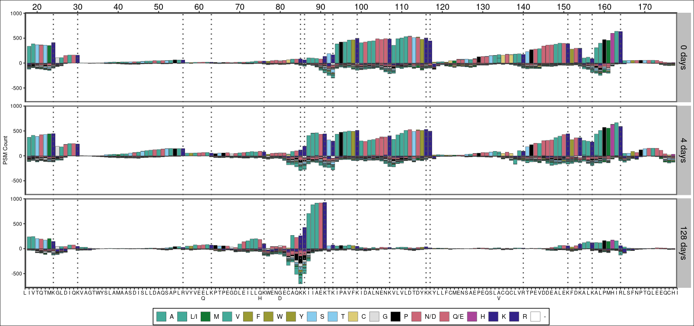
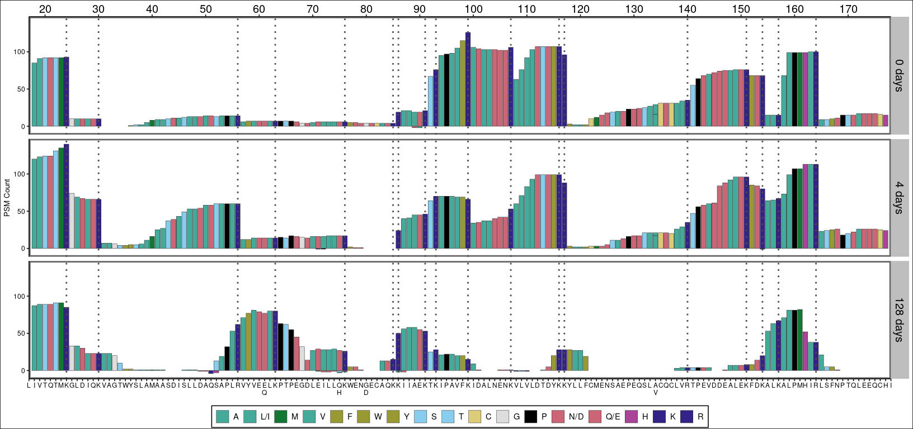
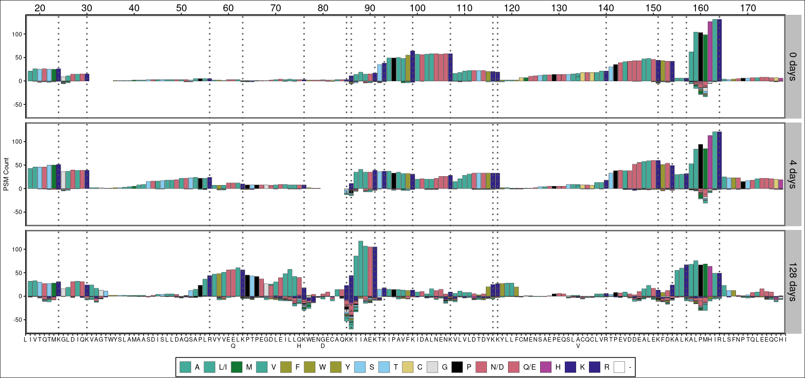
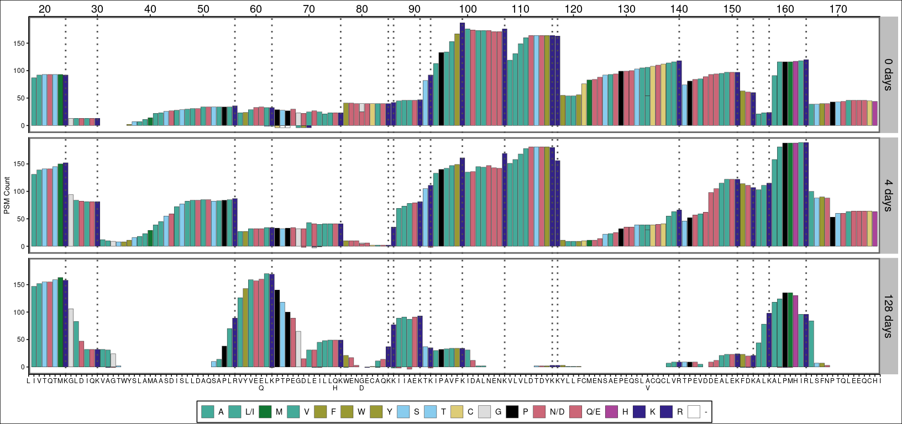
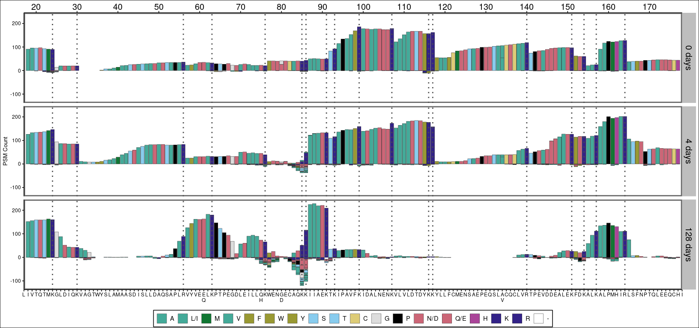
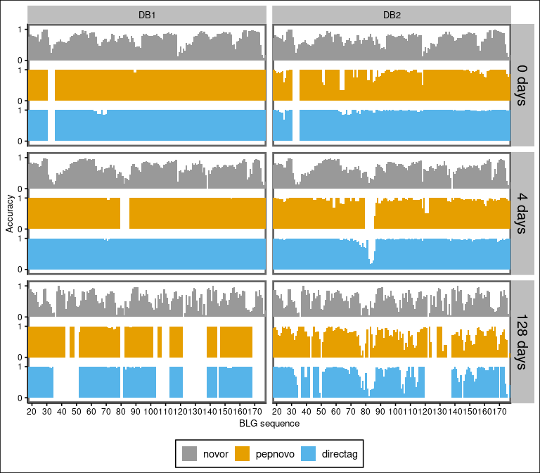
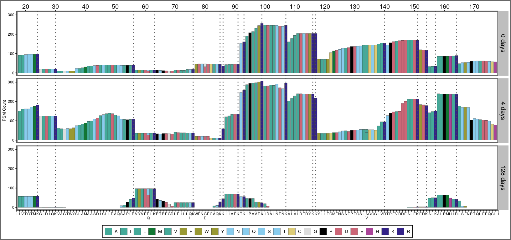
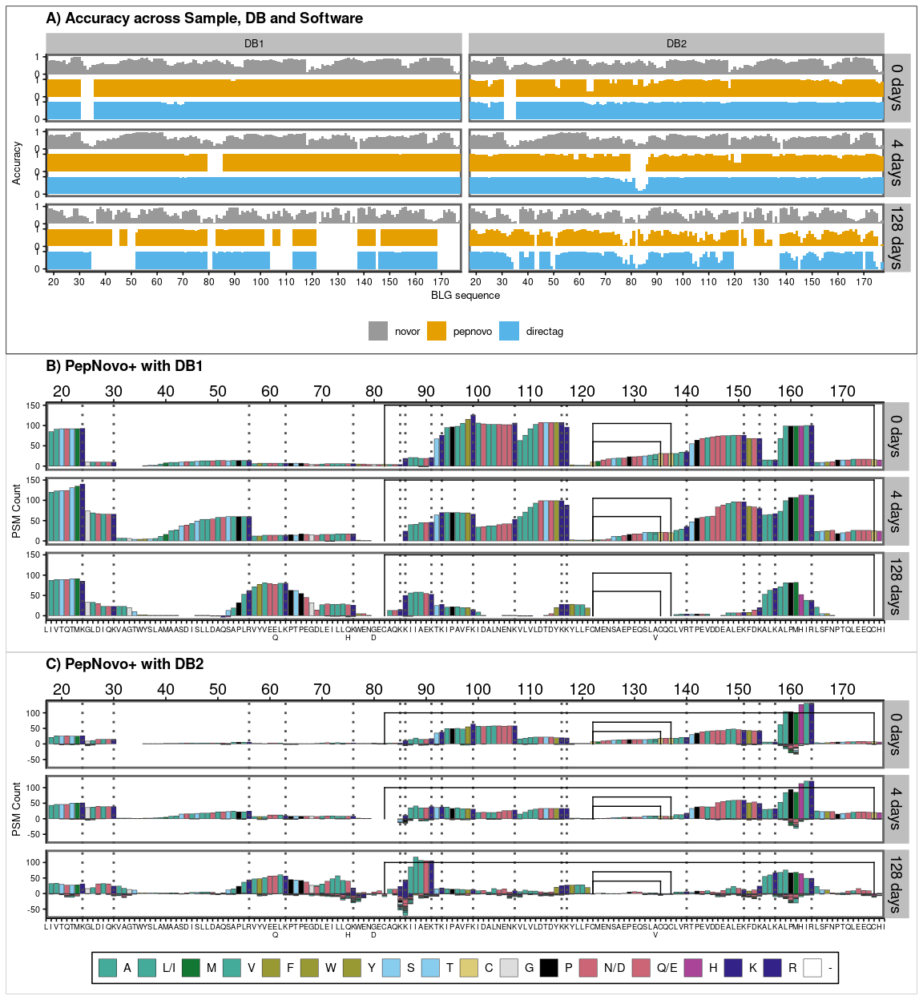
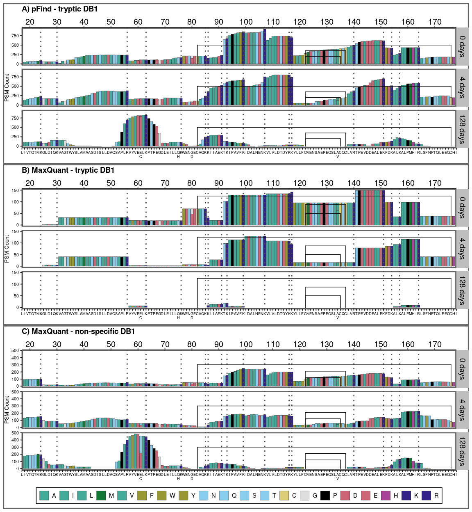

## <!-- # --- -->

title: “Plot positions” author: Ismael Rodriguez output:
github_document: html_preview: false —

``` r
library(ggplot2)
library(tidyverse)
library(ggpubr)
library(ggthemes)
library(patchwork)
```

``` r
project = '~/palaeoproteomics/BLG/analysis_results/'
output_folder = '~/palaeoproteomics/BLG/analysis_results/peptide_coverage'
```

# Define colors and BLG sequence

## Colorblind palettes

- Hydrophobic: blue \#0072B2 A, I, L, M, F, W, V
- Positive: red \#D55E00 K, R
- Negative: magenta \#6F2D77 E, D
- Polar: green \#009E73 N, Q, S, T
- Cysteines: pink \#CC79A7 C
- Glycines: orange \#E69F00 G
- Prolines: yellow \#F0E442 P
- Aromatic: cyan \#56B4E9 H, Y

## Colorblind 2

- Hydrophobic: blue \#0072B2 A, I, L, M, F, W, V
- Positive: red \#D55E00 K, R
- Negative: magenta \#6F2D77 E, D
- Polar: green \#009E73 N, Q, S, T
- C, G, P: pink \#CC79A7 C
- Aromatic: cyan \#56B4E9 H, Y, F

``` r
aa_cols = c(
    "V" = "#8bc34a",
    #
    "I" = "#66fff0",
    "L" = "#009688",
    "L/I" = "#009688",# Average of Ile and Leu
    #
    "F" = "#507351", #9c27b0
    "C" = "#ffeb3b",
    "M" = "#ffeb3b",
    "A" = "#bdd54e",
    "G" = "#9e9e9e",
    "T" = "#ffc75e",
    "W" = "#f49272", #673ab7
    "S" = "#ffc107",
    "Y" = "#30802f",
    "P" = "#607d8b",
    "H" = "#673ab7",
    #
    "Q" = "#faa49e",
    "E" = "#f44336",
    "Q/E" = "#f44336", # Average of Glu and Gln
    #
    "N" = "#f5a3be",
    "D" = "#e81e63",
    "N/D" = "#ee304c", # Average of Asp and Asn
    #
    "K" = "#701637",
    "R" = "#bd3e04",  # 795548  ff5722   c28897
    '-' = 'black'
)

aa_colorblind_2 = c(
    "A" = "#44AA99",
    "I" = "#44AA99",
    "L" = "#44AA99",
    "L/I" = "#44AA99",# Average of Ile and Leu
    "M" = "#117733",
    "V" = "#44AA99", 
    "F" = "#999933", #117733
    "W" = "#999933", 
    "Y" = "#999933",
    
    #
    "N" = "#88CCEE",
    "Q" = "#88CCEE",
    "S" = "#88CCEE",
    "T" = "#88CCEE",
    #
    "C" = "#DDCC77",
    "G" = "#DDDDDD",
    "P" = "black",
    #
    "D" = "#CC6677",
    "E" = "#CC6677",
    "N/D" = "#CC6677",
    "Q/E" = "#CC6677",
    #
    'H' = "#AA4499",
    "K" = "#332288",
    "R" = "#332288",  # 795548  ff5722   c28897
    '-' = 'white'
)


# aa_colorblind_2 = c(
#     "A" = "#56B4E9",
#     "I" = "#56B4E9",
#     "L" = "#56B4E9",
#     "L/I" = "#56B4E9",# Average of Ile and Leu
#     "M" = "#56B4E9",
#     "V" = "#56B4E9",
#     "F" = "#0078ff",
#     "W" = "#0078ff", #673ab7
#     "Y" = "#0078ff",
#     
#     #
#     "N" = "#009E73",
#     "Q" = "#009E73",
#     "S" = "#009E73",
#     "T" = "#009E73",
#     #
#     "C" = "#F0E442",
#     "G" = "gray20",
#     "P" = "gray60",
#     #
#     "D" = "#e13e00",
#     "E" = "#e13e00",
#     "N/D" = "#e13e00",
#     "Q/E" = "#e13e00",
#     #
#     'H' = "#4624c3",
#     "K" = "#6F2D77",
#     "R" = "#6F2D77",  # 795548  ff5722   c28897
#     '-' = 'black'
# )
```

``` r
blg_seq = 'M,K,C,L,L,L,A,L,A,L,T,C,G,A,Q,A,L,I,V,T,Q,T,M,K,G,L,D,I,Q,K,V,A,G,T,W,Y,S,L,A,M,A,A,S,D,I,S,L,L,D,A,Q,S,A,P,L,R,V,Y,V,E,E\nQ,L,K,P,T,P,E,G,D,L,E,I,L,L,Q\nH,K,W,E,N,G\nD,E,C,A,Q,K,K,I,I,A,E,K,T,K,I,P,A,V,F,K,I,D,A,L,N,E,N,K,V,L,V,L,D,T,D,Y,K,K,Y,L,L,F,C,M,E,N,S,A,E,P,E,Q,S,L,A\nV,C,Q,C,L,V,R,T,P,E,V,D,D,E,A,L,E,K,F,D,K,A,L,K,A,L,P,M,H,I,R,L,S,F,N,P,T,Q,L,E,E,Q,C,H,I'
chain_start = 17
chain_end = 178

blg_seq_pos = strsplit(blg_seq, ',')[[1]]

blg_seq = strsplit(blg_seq, ',')[[1]]

tryptic_sites = data.frame(position=which(blg_seq == 'K' | blg_seq == 'R'))

ticks = seq(10, 170, 10)
blg_seq_pos[ticks] = paste0(blg_seq_pos[ticks], '\n\n', ticks)
blg_seq_pos[80] = "G\nD\n80"

disulf_bond = data.frame(
  pos1 = c(82, 122, 122),
  pos2 = c(176, 135, 137),
  height = c(3, 1, 2)
)

base_height = 50
disulf_segments = c()
for (i in 1:nrow(disulf_bond)) {
  height_seg = base_height + disulf_bond[i, 3] * 150
  segment1 = c(disulf_bond[i, 1], 0, disulf_bond[i, 1], height_seg)
  segment2 = c(disulf_bond[i, 1], height_seg, disulf_bond[i, 2], height_seg)
  segment3 = c(disulf_bond[i, 2], height_seg, disulf_bond[i, 2], 0)
  disulf_segments = c(disulf_segments, segment1, segment2, segment3)
}

disulf_segments = matrix(disulf_segments, ncol = 4, byrow = TRUE)
colnames(disulf_segments) = c('x','y','xend','yend')
disulf_segments = data.frame(disulf_segments)

# disulf_segments = matrix(
#   c(82, 0, 82, 50,
#     82, 50, 176, 50,
#     176, 50, 176, 0)
# )
blg_seq_pos = blg_seq_pos[chain_start:length(blg_seq)]
blg_seq = blg_seq[chain_start:length(blg_seq)]


# names(blg_seq) = as.character(seq(1,178))
# blg_seq

# Get K and R tryptic sites
```

# *De novo*

## Plot *de novo* coverage

Change B for L/I X for N/D Z for Q/E

``` r
denovo_position_letters = read_csv(file.path(project, 'denovo_position_letters.csv'))
```

    ## Rows: 16063 Columns: 10
    ## ── Column specification ─────────────────────────────────────────────────────────────────────────────────────
    ## Delimiter: ","
    ## chr (3): Run_id, Sample, pep_letters
    ## dbl (7): pep_positions, count, pep_identity, total_counts, rel_count, count_mirror, rel_count_mirror
    ## 
    ## ℹ Use `spec()` to retrieve the full column specification for this data.
    ## ℹ Specify the column types or set `show_col_types = FALSE` to quiet this message.

``` r
denovo_position_letters$pep_positions = as.integer(denovo_position_letters$pep_positions)
denovo_position_letters
```

    ## # A tibble: 16,063 × 10
    ##    Run_id       Sample pep_positions pep_letters count pep_identity total_counts rel_count count_mirror
    ##    <chr>        <chr>          <int> <chr>       <dbl>        <dbl>        <dbl>     <dbl>        <dbl>
    ##  1 directag_db1 0 days            14 V               1            0            1         1           -1
    ##  2 directag_db1 0 days            15 Z               1            1            1         1            1
    ##  3 directag_db1 0 days            16 A               2            1            2         1            2
    ##  4 directag_db1 0 days            17 B              81            1           81         1           81
    ##  5 directag_db1 0 days            18 B              87            1           87         1           87
    ##  6 directag_db1 0 days            19 V              92            1           92         1           92
    ##  7 directag_db1 0 days            20 T              93            1           93         1           93
    ##  8 directag_db1 0 days            21 Z              93            1           93         1           93
    ##  9 directag_db1 0 days            22 T              93            1           93         1           93
    ## 10 directag_db1 0 days            23 M              93            1           93         1           93
    ## # ℹ 16,053 more rows
    ## # ℹ 1 more variable: rel_count_mirror <dbl>

``` r
denovo_position_letters = denovo_position_letters %>%
  mutate(pep_letters = replace(pep_letters, pep_letters == 'B', 'L/I')) %>%
  mutate(pep_letters = replace(pep_letters, pep_letters == 'X', 'N/D')) %>%
  mutate(pep_letters = replace(pep_letters, pep_letters == 'Z', 'Q/E')) %>%
  mutate(pep_positions = as.integer(pep_positions)) %>%
  filter(pep_positions<=chain_end, pep_positions>=chain_start) %>%
  separate('Run_id', into=c('Software', 'DB'), sep='_', remove = FALSE) %>%
  mutate(Sample = factor(Sample, levels=c('0 days', '4 days', '128 days')),
         pep_letters = factor(pep_letters, levels=names(aa_colorblind_2)),
         Software = factor(Software, levels=c('directag', 'pepnovo', 'novor'))) %>%
  mutate(DB = case_when(DB=='db1' ~ 'DB1', DB=='db2' ~ 'DB2'))

denovo_position_letters
```

    ## # A tibble: 15,402 × 12
    ##    Run_id       Software DB    Sample pep_positions pep_letters count pep_identity total_counts rel_count
    ##    <chr>        <fct>    <chr> <fct>          <int> <fct>       <dbl>        <dbl>        <dbl>     <dbl>
    ##  1 directag_db1 directag DB1   0 days            17 L/I            81            1           81         1
    ##  2 directag_db1 directag DB1   0 days            18 L/I            87            1           87         1
    ##  3 directag_db1 directag DB1   0 days            19 V              92            1           92         1
    ##  4 directag_db1 directag DB1   0 days            20 T              93            1           93         1
    ##  5 directag_db1 directag DB1   0 days            21 Q/E            93            1           93         1
    ##  6 directag_db1 directag DB1   0 days            22 T              93            1           93         1
    ##  7 directag_db1 directag DB1   0 days            23 M              93            1           93         1
    ##  8 directag_db1 directag DB1   0 days            24 K              92            1           92         1
    ##  9 directag_db1 directag DB1   0 days            25 G              13            1           13         1
    ## 10 directag_db1 directag DB1   0 days            26 L/I            13            1           13         1
    ## # ℹ 15,392 more rows
    ## # ℹ 2 more variables: count_mirror <dbl>, rel_count_mirror <dbl>

``` r
denovo_runs = unique(denovo_position_letters$Run_id)
```

``` r
denovo_count_plots = list()
for (run_id in denovo_runs) {
  p1 = denovo_position_letters %>% dplyr::filter(Run_id == run_id) %>%
    ggplot() +
      geom_bar(mapping = aes(x=pep_positions, y=count_mirror, fill=pep_letters),
               position='stack', stat='identity', color='gray20', linewidth=0.2) +
      geom_vline(aes(xintercept=position), data=tryptic_sites, linetype='dotted',
                 color='gray30', linewidth=1) +
      facet_wrap(~Sample, nrow=3, scales = 'fixed', strip.position="right") +
      scale_fill_manual(values=aa_colorblind_2) +
      scale_x_continuous(
        breaks = seq(chain_start, chain_end), labels = blg_seq,
        limits = c(chain_start, chain_end), expand = c(0, 0),
        sec.axis = dup_axis(
          breaks = ticks, labels = ticks,
          guide = guide_axis(theme=theme(axis.text.x=element_text(size=15))))) +
      ylab('PSM Count') +
      theme_clean() +
      guides(fill=guide_legend(nrow=1,byrow=TRUE)) +
      theme(legend.position = 'bottom',
            axis.title.x = element_blank(),
            legend.title = element_blank(), strip.text.y = element_text(size = 15),
            plot.margin = margin(2, 5, 2, 5), strip.background=element_rect(fill='grey'),
            panel.background = element_rect(colour='gray40', linewidth = 2),
            panel.spacing.y = unit(0.2, "cm"),
            panel.grid.major.y = element_blank(),
            panel.grid.minor.y = element_blank())
    denovo_count_plots[[run_id]] = p1
}
```

``` r
denovo_count_plots$novor_db1
```

    ## Warning: Removed 83 rows containing missing values or values outside the scale range (`geom_bar()`).

    ## Warning: Removed 3 rows containing missing values or values outside the scale range (`geom_vline()`).

<!-- -->

``` r
denovo_count_plots$novor_db2
```

    ## Warning: Removed 83 rows containing missing values or values outside the scale range (`geom_bar()`).
    ## Removed 3 rows containing missing values or values outside the scale range (`geom_vline()`).

<!-- -->

``` r
denovo_count_plots$pepnovo_db1
```

    ## Warning: Removed 5 rows containing missing values or values outside the scale range (`geom_bar()`).

    ## Warning: Removed 3 rows containing missing values or values outside the scale range (`geom_vline()`).

<!-- -->

``` r
denovo_count_plots$pepnovo_db2
```

    ## Warning: Removed 9 rows containing missing values or values outside the scale range (`geom_bar()`).
    ## Removed 3 rows containing missing values or values outside the scale range (`geom_vline()`).

<!-- -->

``` r
denovo_count_plots$directag_db1
```

    ## Warning: Removed 5 rows containing missing values or values outside the scale range (`geom_bar()`).

    ## Warning: Removed 3 rows containing missing values or values outside the scale range (`geom_vline()`).

<!-- -->

``` r
denovo_count_plots$directag_db2
```

    ## Warning: Removed 8 rows containing missing values or values outside the scale range (`geom_bar()`).
    ## Removed 3 rows containing missing values or values outside the scale range (`geom_vline()`).

<!-- -->

``` r
denovo_legend = as_ggplot(
  get_legend(denovo_count_plots$novor_db1))
```

    ## Warning: Removed 83 rows containing missing values or values outside the scale range (`geom_bar()`).

    ## Warning: Removed 3 rows containing missing values or values outside the scale range (`geom_vline()`).

``` r
ggsave('denovo_legend.png', denovo_legend, 'png', output_folder,
       width=10, height=1, dpi=400)
ggsave('denovo_legend.svg', denovo_legend, 'svg', output_folder,
       width=10, height=1, dpi=400)


ggsave('novor_db1_cov.png', denovo_count_plots$novor_db1, 'png', output_folder,
       width=17, height=8, dpi=400)
```

    ## Warning: Removed 83 rows containing missing values or values outside the scale range (`geom_bar()`).
    ## Removed 3 rows containing missing values or values outside the scale range (`geom_vline()`).

``` r
ggsave('novor_db1_cov.svg', denovo_count_plots$novor_db1, 'svg', output_folder,
       width=17, height=8, dpi=400)
```

    ## Warning: Removed 83 rows containing missing values or values outside the scale range (`geom_bar()`).
    ## Removed 3 rows containing missing values or values outside the scale range (`geom_vline()`).

``` r
ggsave('pepnovo_db2_cov.png', denovo_count_plots$pepnovo_db2, 'png', output_folder,
       width=17, height=8, dpi=400)
```

    ## Warning: Removed 9 rows containing missing values or values outside the scale range (`geom_bar()`).
    ## Removed 3 rows containing missing values or values outside the scale range (`geom_vline()`).

``` r
ggsave('pepnovo_db2_cov.svg', denovo_count_plots$pepnovo_db2, 'svg', output_folder,
       width=17, height=8, dpi=400)
```

    ## Warning: Removed 9 rows containing missing values or values outside the scale range (`geom_bar()`).
    ## Removed 3 rows containing missing values or values outside the scale range (`geom_vline()`).

``` r
denovo_position_letters = denovo_position_letters %>% group_by(Software, Sample) %>%
  mutate(MAX = max(count_mirror), MIN = min(count_mirror))
```

``` r
ggplot(denovo_position_letters, aes(x=pep_positions, y=count_mirror, fill=pep_letters)) +
  geom_bar(position='stack', stat='identity', color='gray20', linewidth=0.2) +
  geom_vline(aes(xintercept=position), data=tryptic_sites, linetype='dotted',
                 color='gray30', linewidth=1) +
  geom_blank(aes(y=MAX)) + geom_blank(aes(y=MIN)) +
  facet_grid(Sample + Software ~ DB, scales='free') +
  scale_fill_manual(values=aa_colorblind_2) +
  scale_x_continuous(breaks = seq(chain_start, chain_end), labels = blg_seq,
                     limits = c(chain_start, chain_end), expand = c(0, 0)) +
  xlab('BLG sequence') + ylab('Count') +
  guides(fill=guide_legend(nrow=1,byrow=TRUE)) +
  theme_clean() +
  theme(panel.grid.major.y = element_blank(),
        panel.grid.minor.y = element_blank(),
        legend.title = element_blank(),
        strip.text = element_text(size = 12, margin = margin(0,0,0,0)),
        axis.title.y = element_blank(),
        axis.text.x = element_text(size=6),
        plot.margin = margin(3,5,3,5),
        legend.margin = margin(0,0,0,0),
        strip.switch.pad.grid = unit(0, 'cm'),
        strip.switch.pad.wrap = unit(0, 'cm'),
        strip.placement = 'inside',
        panel.spacing.y = unit(10, 'pt'),
        strip.background=element_rect(fill='grey'),
        panel.background = element_rect(colour='gray40', linewidth = 2),
        legend.position = 'bottom')
```

    ## Warning: Removed 193 rows containing missing values or values outside the scale range (`geom_bar()`).

    ## Warning: Removed 18 rows containing missing values or values outside the scale range (`geom_vline()`).

<!-- -->

## Plot accuracy per position

``` r
denovo_position_acc = read_csv(file.path(project, 'denovo_position_accuracy.csv'))
```

    ## Rows: 2898 Columns: 4
    ## ── Column specification ─────────────────────────────────────────────────────────────────────────────────────
    ## Delimiter: ","
    ## chr (2): Run_id, Sample
    ## dbl (2): pep_positions, pos_accuracy
    ## 
    ## ℹ Use `spec()` to retrieve the full column specification for this data.
    ## ℹ Specify the column types or set `show_col_types = FALSE` to quiet this message.

``` r
denovo_position_acc = denovo_position_acc %>%
  filter(pep_positions<=chain_end, pep_positions>=chain_start) %>%
  separate('Run_id', into=c('Software', 'DB'), sep='_', remove = FALSE) %>%
  mutate(pep_positions = as.integer(pep_positions),
         Software = factor(Software, levels=c('novor', 'pepnovo', 'directag')),
         Sample = factor(Sample, levels=c('0 days', '4 days', '128 days'))) %>%
  mutate(DB = case_when(DB=='db1' ~ 'DB1', DB=='db2' ~ 'DB2'))
denovo_position_acc
```

    ## # A tibble: 2,772 × 6
    ##    Run_id       Software DB    Sample pep_positions pos_accuracy
    ##    <chr>        <fct>    <chr> <fct>          <int>        <dbl>
    ##  1 directag_db1 directag DB1   0 days            17            1
    ##  2 directag_db1 directag DB1   0 days            18            1
    ##  3 directag_db1 directag DB1   0 days            19            1
    ##  4 directag_db1 directag DB1   0 days            20            1
    ##  5 directag_db1 directag DB1   0 days            21            1
    ##  6 directag_db1 directag DB1   0 days            22            1
    ##  7 directag_db1 directag DB1   0 days            23            1
    ##  8 directag_db1 directag DB1   0 days            24            1
    ##  9 directag_db1 directag DB1   0 days            25            1
    ## 10 directag_db1 directag DB1   0 days            26            1
    ## # ℹ 2,762 more rows

``` r
# a = denovo_position_acc %>% 
#   mutate(remaining = 1 - pos_accuracy) %>%
#   pivot_longer(cols=c(pos_accuracy, remaining)) %>%
#   mutate(Software = case_when(name == 'remaining' ~ paste0(Software, '_', name),
#                               name == 'pos_accuracy' ~ Software))
colorBlindGrey8 <- c(
  pepnovo = "#E69F00",
  novor = "#999999",
  directag = "#56B4E9")

software_margin = 0.3
a = denovo_position_acc %>%
  mutate(
    xmin = pep_positions - 0.5, xmax = pep_positions + 0.59,
    ymin = case_when(
      Software == 'directag' ~ 0,
      Software == 'pepnovo' ~ 1+software_margin,
      Software == 'novor' ~ 2+software_margin * 2
    ),
    ymax = case_when(
      Software == 'directag' ~ pos_accuracy,
      Software == 'pepnovo' ~ pos_accuracy + 1 +software_margin,
      Software == 'novor' ~ pos_accuracy + 2+software_margin * 2
    )
  )
```

``` r
denovo_acc_plot = ggplot(a) +
    geom_rect(mapping = aes(
                xmin=xmin, xmax=xmax, ymin=ymin, ymax=ymax,
                fill=Software),
              stat='identity', position='identity') +
    facet_grid(Sample~DB, scales='fixed') +
    # scale_x_continuous(breaks = seq(chain_start, chain_end), labels = blg_seq,
    #                    limits = c(chain_start, chain_end), expand=c(0,0)) +
    scale_x_continuous(breaks = ticks, labels = ticks,
                       limits = c(chain_start, chain_end), expand=c(0,0)) +
    scale_y_continuous(breaks=c(0, 1, 1.3, 2.3,  2.6, 3.6), labels=c(0,1,0,1,0,1)) +
    xlab('BLG sequence') + ylab('Accuracy') +
    scale_fill_manual(values=colorBlindGrey8) +
    guides(fill=guide_legend(nrow=1,byrow=TRUE)) +
    theme_clean() +
    theme(panel.grid.major.y = element_blank(),
          panel.grid.minor.y = element_blank(),
          legend.title = element_blank(),
          strip.text.y = element_text(size = 15),
          strip.background=element_rect(fill='grey'),
          legend.position = 'bottom',
          legend.direction = 'horizontal',
          panel.background = element_rect(colour='gray40', linewidth = 2),
          panel.spacing.y = unit(0.2, "cm"))

denovo_acc_plot
```

    ## Warning: Removed 34 rows containing missing values or values outside the scale range (`geom_rect()`).

<!-- -->

# Plot DB search coverage

``` r
dbsearch_position_letters = read_csv(file.path(project, 'dbsearch_position_letters.csv'))
```

    ## Rows: 23547 Columns: 21
    ## ── Column specification ─────────────────────────────────────────────────────────────────────────────────────
    ## Delimiter: ","
    ## chr (10): Run_id, Sample, pep_letters, Search, Engine, Digestion, DB, Pep_length, System, Run settings
    ## dbl  (8): pep_positions, count, mean_pI, total_counts, FDR, rel_count, count_mirror, rel_count_mirror
    ## lgl  (3): is_lacb, gt_005fdr, correct
    ## 
    ## ℹ Use `spec()` to retrieve the full column specification for this data.
    ## ℹ Specify the column types or set `show_col_types = FALSE` to quiet this message.

``` r
dbsearch_runs = unique(dbsearch_position_letters$Run_id)
```

``` r
dbsearch_position_letters$Sample[dbsearch_position_letters$Sample == 'N0000'] = '0 days'
dbsearch_position_letters$Sample[dbsearch_position_letters$Sample == 'N0040'] = '4 days'
dbsearch_position_letters$Sample[dbsearch_position_letters$Sample == 'N1280'] = '128 days'

dbsearch_position_letters = dbsearch_position_letters %>%
  mutate(Sample = factor(Sample, levels=c('0 days', '4 days', '128 days')),
         pep_positions = as.integer(pep_positions),
         pep_letters = factor(pep_letters, levels=names(aa_colorblind_2))) %>%
  filter(pep_positions<=chain_end, pep_positions>=chain_start) %>%
  arrange(desc(pep_positions))

dbsearch_position_letters
```

    ## # A tibble: 19,861 × 21
    ##    Run_id    Sample is_lacb gt_005fdr pep_positions pep_letters count mean_pI total_counts Search Engine  
    ##    <chr>     <fct>  <lgl>   <lgl>             <int> <fct>       <dbl>   <dbl>        <dbl> <chr>  <chr>   
    ##  1 fp_ns_db1 0 days TRUE    FALSE               178 I             105    5.44          105 Open   Fragpipe
    ##  2 fp_ns_db1 4 days TRUE    FALSE               178 I              36    6.01           36 Open   Fragpipe
    ##  3 fp_ns_db2 0 days TRUE    FALSE               178 I             189    4.87          189 Open   Fragpipe
    ##  4 fp_ns_db2 0 days TRUE    TRUE                178 I              37    4.59           37 Open   Fragpipe
    ##  5 fp_ns_db2 4 days TRUE    FALSE               178 I             127    4.70          127 Open   Fragpipe
    ##  6 fp_ns_db2 4 days TRUE    TRUE                178 I              56    4.33           56 Open   Fragpipe
    ##  7 fp_st_db1 0 days TRUE    FALSE               178 I             101    5.05          101 Open   Fragpipe
    ##  8 fp_st_db1 4 days TRUE    FALSE               178 I              35    5.94           35 Open   Fragpipe
    ##  9 fp_st_db2 0 days TRUE    FALSE               178 I             203    4.63          203 Open   Fragpipe
    ## 10 fp_st_db2 0 days TRUE    TRUE                178 I              22    4.33           22 Open   Fragpipe
    ## # ℹ 19,851 more rows
    ## # ℹ 10 more variables: Digestion <chr>, DB <chr>, Pep_length <chr>, FDR <dbl>, System <chr>,
    ## #   `Run settings` <chr>, rel_count <dbl>, correct <lgl>, count_mirror <dbl>, rel_count_mirror <dbl>

``` r
plots_db_counts = list()

for (run_id in dbsearch_runs) {
  p1 = dbsearch_position_letters %>% dplyr::filter(gt_005fdr==FALSE, Run_id == run_id) %>%
  ggplot() +
    geom_bar(mapping = aes(x=pep_positions, y=count_mirror, fill=pep_letters),
             position='stack', stat='identity', color='gray20', linewidth=0.2) +
    geom_vline(aes(xintercept=position), data=tryptic_sites, linetype='dotted', color='gray30',
               linewidth=1) +
    facet_wrap(~Sample, nrow=3, scales='fixed', strip.position="right") +
    scale_fill_manual(values=aa_colorblind_2) +
    scale_x_continuous(
      breaks = seq(chain_start, chain_end), labels = blg_seq,
      limits = c(chain_start, chain_end), expand=c(0,0),
      sec.axis = dup_axis(
          breaks = ticks, labels = ticks,
          guide = guide_axis(theme=theme(axis.text.x=element_text(size=15))))) +
    ylab('PSM Count') +
    guides(fill=guide_legend(nrow=1,byrow=TRUE)) +
    theme_clean() +
    theme(panel.grid.major.y = element_blank(),
          panel.grid.minor.y = element_blank(),
          axis.title.x = element_blank(),
          legend.title = element_blank(),
          strip.text.y = element_text(size = 15),
          strip.background=element_rect(fill='grey'),
          legend.position = 'bottom',
          legend.direction = 'horizontal',
          panel.background = element_rect(colour='gray40', linewidth = 2), panel.spacing.y = unit(0.2, "cm"),
          plot.background = element_rect(colour='gray40', linewidth = 2))

  plots_db_counts[[run_id]] = p1
}
```

``` r
plots_db_counts$pf_t_db1
```

    ## Warning: Removed 4 rows containing missing values or values outside the scale range (`geom_bar()`).

    ## Warning: Removed 3 rows containing missing values or values outside the scale range (`geom_vline()`).

<!-- -->

``` r
plots_db_counts$mq_st_db1
```

    ## Warning: Removed 5 rows containing missing values or values outside the scale range (`geom_bar()`).
    ## Removed 3 rows containing missing values or values outside the scale range (`geom_vline()`).

<!-- -->

``` r
ggsave('pf_st_db1_cov.png', plots_db_counts$pf_st_db1, 'png', project,
       width=17, height=8, dpi=400)
```

    ## Warning: Removed 4 rows containing missing values or values outside the scale range (`geom_bar()`).

    ## Warning: Removed 3 rows containing missing values or values outside the scale range (`geom_vline()`).

``` r
ggsave('pf_st_db1_cov.svg', plots_db_counts$pf_st_db1, 'svg', project,
       width=17, height=8, dpi=400)
```

    ## Warning: Removed 4 rows containing missing values or values outside the scale range (`geom_bar()`).
    ## Removed 3 rows containing missing values or values outside the scale range (`geom_vline()`).

``` r
dbsearch_legend = as_ggplot(
  get_legend(plots_db_counts$pf_st_db1))
```

    ## Warning: Removed 4 rows containing missing values or values outside the scale range (`geom_bar()`).
    ## Removed 3 rows containing missing values or values outside the scale range (`geom_vline()`).

``` r
ggsave('dbsearch_legend.png', dbsearch_legend, 'png', project,
       width=10, height=1, dpi=400)
ggsave('dbsearch_legend.svg', dbsearch_legend, 'svg', project,
       width=10, height=1, dpi=400)
```

# Arrange plots

## *De novo*

``` r
# disulf_segments %>% mutate(y = y*0.6, yend = yend*0.6)

denovo_acc_plot = denovo_acc_plot +
      ggtitle('A) Accuracy across Sample, DB and Software') +
      theme(legend.key.size = unit(0.7, 'cm'), #change legend key size
            legend.text = element_text(size=10),
            legend.background = element_rect(color = NA)) #change legend text font size

directag_db1_cov = denovo_count_plots$pepnovo_db1 +
  geom_segment(aes(x=x, y=y*0.3, xend=xend, yend=yend*0.3),
               data=disulf_segments,
               color='black', alpha=1, lineend = 'square',
               linejoin = 'round') +
  ggtitle('B) PepNovo+ with DB1') +
  theme(strip.text.y = element_text(size=14),
        plot.background = element_rect(fill='white', colour = 'grey', linewidth = 0.5),
        legend.position = "none",
        axis.title.x = element_blank(),
        plot.margin = margin(5, 0, 10, 3),
        axis.text.x = element_text(size=7),
        axis.text.y = element_text(angle=0, size=8))


novor_db1_cov = denovo_count_plots$pepnovo_db2 +
  # scale_y_continuous(position='right') +
  geom_segment(aes(x=x, y=y*0.2, xend=xend, yend=yend*0.2), data=disulf_segments,
                   color='black', alpha=1, lineend = 'square',
                   linejoin = 'round') +
  ggtitle('C) PepNovo+ with DB2') +
  theme(strip.text.y = element_text(size=14),
        # legend.position = "none",
        plot.background = element_rect(fill='white', colour = 'grey', linewidth = 0.5),
        axis.title.x = element_blank(),
        plot.margin = margin(5, 0, 10, 3),
        axis.text.x = element_text(size=7),
        axis.text.y = element_text(angle=0, size=8))


denovo_comboplot = denovo_acc_plot + directag_db1_cov + novor_db1_cov +
  plot_layout(ncol=1, heights = c(1, 1, 1))
denovo_comboplot
```

    ## Warning: Removed 34 rows containing missing values or values outside the scale range (`geom_rect()`).

    ## Warning: Removed 5 rows containing missing values or values outside the scale range (`geom_bar()`).

    ## Warning: Removed 3 rows containing missing values or values outside the scale range (`geom_vline()`).

    ## Warning: Removed 9 rows containing missing values or values outside the scale range (`geom_bar()`).

    ## Warning: Removed 3 rows containing missing values or values outside the scale range (`geom_vline()`).

<!-- -->

``` r
ggsave('denovo_combo_plot.svg', denovo_comboplot, 'svg', output_folder,
       width=12, height=13, dpi=400)
```

    ## Warning: Removed 34 rows containing missing values or values outside the scale range (`geom_rect()`).

    ## Warning: Removed 5 rows containing missing values or values outside the scale range (`geom_bar()`).

    ## Warning: Removed 3 rows containing missing values or values outside the scale range (`geom_vline()`).

    ## Warning: Removed 9 rows containing missing values or values outside the scale range (`geom_bar()`).

    ## Warning: Removed 3 rows containing missing values or values outside the scale range (`geom_vline()`).

``` r
ggsave('denovo_combo_plot.png', denovo_comboplot, 'png', output_folder,
       width=12, height=13, dpi=400)
```

    ## Warning: Removed 34 rows containing missing values or values outside the scale range (`geom_rect()`).

    ## Warning: Removed 5 rows containing missing values or values outside the scale range (`geom_bar()`).

    ## Warning: Removed 3 rows containing missing values or values outside the scale range (`geom_vline()`).

    ## Warning: Removed 9 rows containing missing values or values outside the scale range (`geom_bar()`).

    ## Warning: Removed 3 rows containing missing values or values outside the scale range (`geom_vline()`).

``` r
pf_t_db1_cov = plots_db_counts$pf_t_db1 +
  # scale_y_continuous(position='right') +
  geom_segment(aes(x=x, y=y, xend=xend, yend=yend), data=disulf_segments,
                   color='black', alpha=1, lineend = 'square',
                   linejoin = 'round') +
  ggtitle('A) pFind - tryptic DB1') +
  theme(strip.text.y = element_text(size=14),
        legend.position = "none",
        axis.title.x = element_blank(),
        plot.margin = margin(5, 0, 10, 3),
        axis.text.x = element_text(size=7),
        axis.text.y = element_text(angle=0, size=8))

mq_t_db1_cov = plots_db_counts$mq_t_db1 +
  # scale_y_continuous(position='right') +
  geom_segment(aes(x=x, y=y*0.25, xend=xend, yend=yend*0.25), data=disulf_segments,
                   color='black', alpha=1, lineend = 'square',
                   linejoin = 'round') +
  ggtitle('B) MaxQuant - tryptic DB1') +
  theme(strip.text.y = element_text(size=14),
        legend.position = "none",
        axis.title.x = element_blank(),
        plot.margin = margin(5, 0, 10, 3),
        axis.text.x = element_text(size=7),
        axis.text.y = element_text(angle=0, size=8))


mq_ns_db1_cov = plots_db_counts$mq_ns_db1 +
  # scale_y_continuous(position='right') +
  geom_segment(aes(x=x, y=y*0.6, xend=xend, yend=yend*0.6), data=disulf_segments,
                   color='black', alpha=1, lineend = 'square',
                   linejoin = 'round') +
  ggtitle('C) MaxQuant - non-specific DB1') +
  theme(strip.text.y = element_text(size=14),
        # legend.position = "none",
        axis.title.x = element_blank(),
        plot.margin = margin(5, 0, 10, 3),
        axis.text.x = element_text(size=7),
        axis.text.y = element_text(angle=0, size=8))


dbsearch_comboplot = pf_t_db1_cov + mq_t_db1_cov + mq_ns_db1_cov + plot_layout(ncol=1)
dbsearch_comboplot
```

    ## Warning: Removed 4 rows containing missing values or values outside the scale range (`geom_bar()`).

    ## Warning: Removed 3 rows containing missing values or values outside the scale range (`geom_vline()`).

    ## Warning: Removed 2 rows containing missing values or values outside the scale range (`geom_bar()`).

    ## Warning: Removed 3 rows containing missing values or values outside the scale range (`geom_vline()`).

    ## Warning: Removed 5 rows containing missing values or values outside the scale range (`geom_bar()`).

    ## Warning: Removed 3 rows containing missing values or values outside the scale range (`geom_vline()`).

<!-- -->

``` r
ggsave('dbsearch_combo_plot.svg', dbsearch_comboplot, 'svg', output_folder,
       width=12, height=13, dpi=400)
```

    ## Warning: Removed 4 rows containing missing values or values outside the scale range (`geom_bar()`).
    ## Removed 3 rows containing missing values or values outside the scale range (`geom_vline()`).

    ## Warning: Removed 2 rows containing missing values or values outside the scale range (`geom_bar()`).

    ## Warning: Removed 3 rows containing missing values or values outside the scale range (`geom_vline()`).

    ## Warning: Removed 5 rows containing missing values or values outside the scale range (`geom_bar()`).

    ## Warning: Removed 3 rows containing missing values or values outside the scale range (`geom_vline()`).

``` r
ggsave('dbsearch_combo_plot.png', dbsearch_comboplot, 'png', output_folder,
       width=12, height=13, dpi=400)
```

    ## Warning: Removed 4 rows containing missing values or values outside the scale range (`geom_bar()`).
    ## Removed 3 rows containing missing values or values outside the scale range (`geom_vline()`).

    ## Warning: Removed 2 rows containing missing values or values outside the scale range (`geom_bar()`).

    ## Warning: Removed 3 rows containing missing values or values outside the scale range (`geom_vline()`).

    ## Warning: Removed 5 rows containing missing values or values outside the scale range (`geom_bar()`).

    ## Warning: Removed 3 rows containing missing values or values outside the scale range (`geom_vline()`).
